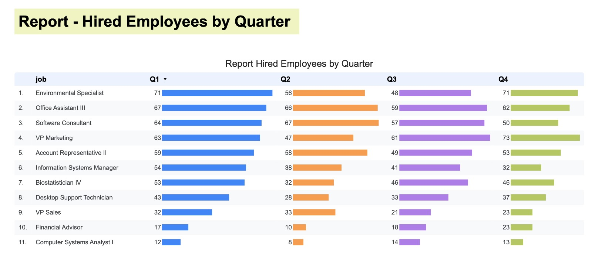

# 📊 Demo de API para Ingesta y Reportes con Google Cloud (BigQuery + Cloud Storage)

Este proyecto expone una API REST construida con Flask para:

- Ingestar datos de empleados, departamentos y trabajos.
- Validar los registros recibidos.
- Cargar registros válidos en BigQuery.
- Guardar registros inválidos en un bucket de Google Cloud Storage.
- Consultar reportes mediante SQL almacenado.

---

## 🧰 Tecnologías

- Python 3.10
- Flask
- Pydantic
- Google Cloud SDK: BigQuery y Cloud Storage

---

## 🚀 Despliegue

Esta API está diseñada para ejecutarse en **Cloud Run** o cualquier entorno compatible con Flask.

### Variables de entorno requeridas

| Variable            | Descripción                              |
|---------------------|------------------------------------------|
| `GCP_PROJECT_ID`     | ID del proyecto de GCP                  |
| `GCS_BUCKET_NAME`    | (Opcional) Nombre del bucket GCS (hardcodeado como `demo-log-hb`) |

> Actualmente el bucket se encuentra hardcodeado en el código (`demo-log-hb`), pero puede parametrizarse.

---

## 📥 Endpoints de Ingesta

Todos los endpoints aceptan listas de objetos JSON (máx 1000 registros por solicitud).

### POST `/hired_employees`

Carga registros de empleados contratados. Valida que los campos no estén vacíos.

```json
[
  {
    "id": 1,
    "name": "John Doe",
    "datetime": "2023-06-01T10:00:00Z",
    "department_id": 2,
    "job_id": 3
  }
]
```

### POST `/departments`

Carga departamentos.

```json
[
  {
    "id": 1,
    "department": "Engineering"
  }
]
```

### POST `/jobs`

Carga tipos de trabajo.

```json
[
  {
    "id": 1,
    "job": "Software Engineer"
  }
]
```

---

## 🧪 Validación de Datos

- Todos los campos deben ser distintos de `null`.
- Los registros válidos se insertan en BigQuery.
- Los registros inválidos se guardan como JSON en Cloud Storage : `gs://demo-log-hb/log/`.

---

## 📤 Endpoints de Reporte

Estos endpoints ejecutan consultas SQL ubicadas en el directorio `/sql`.

### GET `/data/reporte-01`

Ejecuta `Reporte_01.sql` y devuelve los resultados.

### GET `/data/reporte-02`

Ejecuta `Reporte_02.sql` y devuelve los resultados.

---

## 📾 Estructura del Proyecto

```
.
├── github/
│   └── workflow/
│       ├── deploy_maintain.yml
│       └── deploy.yml
├── api/
│   ├── sql/
│   │  ├── Reporte_01.sql
│   │  └── Reporte_02.sql
│   ├── main.py
│   └── docs/
├── maintain/                   
│   ├── data_maintain.py
│   ├── main.py
│   └── requirements.txt
├── Dockerfile
├── README.md
└── requirements.txt
```

---

## 📊 Dashboards




---

## 📦 Instalación Local (opcional)

```bash
python3 -m venv venv
source venv/bin/activate
pip install -r requirements.txt
export GCP_PROJECT_ID=<your-project-id>
flask run
```

---

## 📁 Archivos inválidos en GCS

Cuando se detectan registros con campos nulos, estos se almacenan automáticamente en:

```
gs://demo-log-hb/log/<prefix>_invalid_<timestamp>.json
```

---

## 📝 Notas

- El batch está limitado a 1000 registros por request.
- Se cuenta con una carpeta test para hacer pruebas locales.

---

## 📧 Contacto

Para soporte o preguntas, podés contactarme a través de harben16@gmail.comq.
